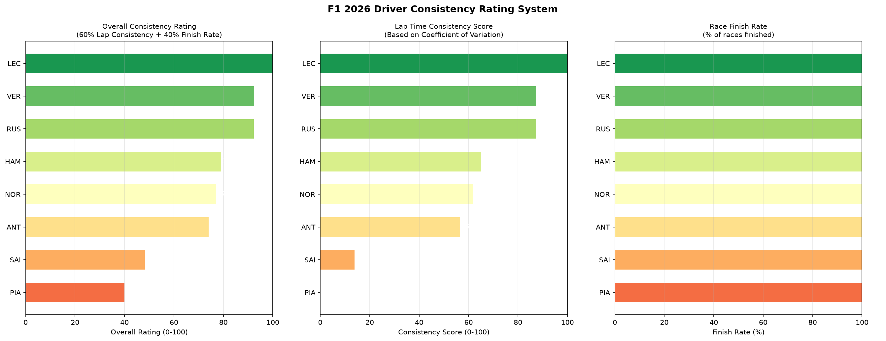

# F1 Driver Consistency Rating System

A Python tool that builds a data-driven consistency rating for Formula 1 
drivers based on lap time stability and race finish rate across the 2026 season.

## What it does

This script analyses race data for every Grand Prix of the 2026 season 
and produces three horizontal bar charts:

- Overall consistency rating — a weighted score combining lap time 
  consistency (60%) and race finish rate (40%)
- Lap time consistency score — based on the coefficient of variation 
  of clean lap times across the season
- Race finish rate — percentage of races where the driver reached the finish

## Methodology

Lap time consistency is measured using the Coefficient of Variation (CV) — 
the standard deviation divided by the mean lap time, expressed as a percentage. 
A lower CV means more consistent lap times. The CV is then converted to a 
0-100 score where higher is better.

The overall rating combines:
- 60% lap time consistency score
- 40% race finish rate

## Example Output

The 2026 analysis reveals Leclerc as the most consistent driver despite 
Ferrari's mid-table championship position. Antonelli, the championship leader, 
ranks 6th in consistency — suggesting he scores big points when conditions 
favour him but carries more risk than teammates Russell or Hamilton. 
Piastri scores lowest overall due to a poor race finish rate.

## Tech Stack

- Python
- [FastF1](https://github.com/theOehrly/Fast-F1) — official F1 timing and telemetry data
- Matplotlib — data visualisation
- Pandas — data aggregation
- NumPy — statistical calculations

## How to Run

1. Install dependencies: `pip install fastf1 matplotlib pandas numpy`
2. Run the script: `python driver_consistency.py`
3. Chart will display and save as `driver_consistency.png`

## Why This Project

Consistency is one of the most valuable but underrated qualities in a 
racing driver. This rating system builds a quantitative framework for 
evaluating driver reliability — the kind of analysis race engineers and 
sporting directors use when evaluating driver performance and contract 
decisions.

## Author

Hamna Shahzad — Electrical Engineering Student | Aspiring Motorsport Engineer
